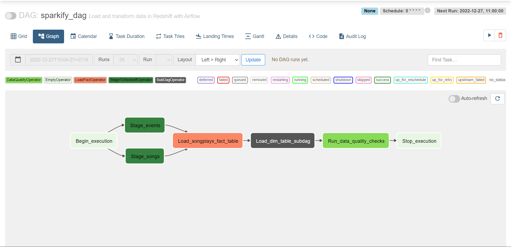

# Project: Data Pipelines with Airflow
A music streaming company, Sparkify, has decided that it is time to introduce more automation and monitoring to their data warehouse ETL pipelines and come to the conclusion that the best tool to achieve this is Apache Airflow.

They have decided to bring you into the project and expect you to create high grade data pipelines that are dynamic and built from reusable tasks, can be monitored, and allow easy backfills. They have also noted that the data quality plays a big part when analyses are executed on top the data warehouse and want to run tests against their datasets after the ETL steps have been executed to catch any discrepancies in the datasets.

The source data resides in S3 and needs to be processed in Sparkify's data warehouse in Amazon Redshift. The source datasets consist of JSON logs that tell about user activity in the application and JSON metadata about the songs the users listen to.

# Project Overview
This project will introduce you to the core concepts of Apache Airflow. To complete the project, you will need to create your own custom operators to perform tasks such as staging the data, filling the data warehouse, and running checks on the data as the final step.

We have provided you with a project template that takes care of all the imports and provides four empty operators that need to be implemented into functional pieces of a data pipeline. The template also contains a set of tasks that need to be linked to achieve a coherent and sensible data flow within the pipeline.

You'll be provided with a helpers class that contains all the SQL transformations. Thus, you won't need to write the ETL yourselves, but you'll need to execute it with your custom operators.

## Required
- Docker compose
- Config enviroment via dwh.cfg file
- This airflow:2.5.0 (Dependencies changes)

## Prerequisites
- Create an IAM User in AWS.
- Create a redshift cluster in AWS (This cluster in the `us-west-2` region)

## Setting up Connections

- Connect Airflow and AWS
    + Follow the steps on the page Connect Airflow to AWS in the lesson Data Pipelines.
    + Use the workspace provided on the page Project Workspace in this lesson.
- Connect Airflow to the AWS Redshift Cluster
    + Follow the steps on the page Add Airflow Connections to AWS Redshift in the lesson Data Pipelines.

# Datasets
For this project, you'll be working with two datasets. Here are the s3 links for each:

Log data: `s3://udacity-dend/log_data`

Song data: `s3://udacity-dend/song_data`

# Project Template
To get started with the project:

`1. On the project workspace page after the project instructions, you'll find the project template. You can work on your project and submit your work through this workspace. Alternatively, you can download the project template package and put the contents of the package in their respective folders in your local Airflow installation. The project template package contains three major components for the project:
The dag template has all the imports and task templates in place, but the task dependencies have not been set
The operators folder with operator templates
A helper class for the SQL transformations`

`2. With these template files, you should be able see the new DAG in the Airflow UI. The graph view should look like this:`

# Configuring the DAG
In the DAG, add default parameters according to these guidelines
 - The DAG does not have dependencies on past runs
 - On failure, the task are retried 3 times
 - Retries happen every 5 minutes'
 - Catchup is turned off
 - Do not email on retry

# How to run
1. - Run docker command `docker compose up airflow-init`
   - `docker-compose up`
2. Launch the cluster: 
   - run this command to setup enviroment `python cluster.py --launch`
   - run command to create table `python cluster.py --create_table`
3. Run airflow:
    After launch the cluster, check dwh.cfg file to get information
   - Setting variable for airflow: 
   * Connection
       + Connection Id: ######
       + Connection Type: Amazon Web Services
       + Login: ####
       + Password: ####
       ----------------------------
       + Connection Id: ####
       + Connection Type: Postgres
       + Login: ####
       + Password: ####
       + Host: ####
       + Port: 5439
       + Schema: dev
    Run airflow's dag
4. Close and delete redshift:
    - Run this command: `python cluster.py --stop`
    

